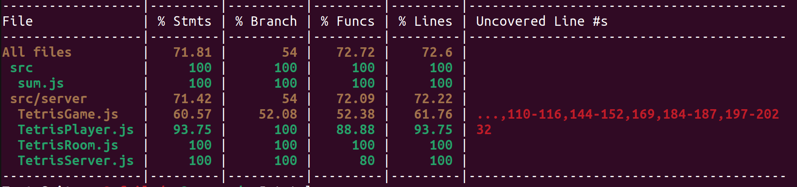

# Red Tetris [42 Porject]
>The objective of this project is to develop a networked multiplayer tetris game from a stack of software exclusively Full Stack Javascript
---
### Built with
##### Front-end
	- React.js + Redux
	- Socket.io
##### Back-end
	- Node.js
	- Socket.io

---


### How to start

```
Install dependecy: npm install
Start server: npm run-script srv-dev
Start client: npm run-script client-dev
Test Coverage: npm run-script coverage
```
---
### Coverage Result

---
#### Page
- Enter Player Name
- Enter Room number / Create a room
- Play
- (ScoreBoard)

---

#### Socket Behavior
- Server to Client
	- Connect accept or decline
	- Start
	- Puzzle type
	- Oppsing player movement
	- Oppsing player disconnect

- Client to Server
	- Join a room
	- Left a room
	- Movement
		- Rotation
		- Horizontal move (Left or Right)
		- Touch the pile
		- Destory line counts
		- Lose

---

#### Socket information

##### Server
- Get New Puzzle
```
{
	event: newPuzzle:
	data:{
		type: (int)
	}
}
```

- Get Opponment update
```
{
	event: op_puzzle:
	data:{
		type: (int)
	}
}
```
- message
```
{
	event: op_(next/action/...):
	player: (player1/player2)
	data:
	{
		data (left/right/rotate):
		Value:
	}
}
```


- Error
```
{
	event: error:
	data:{
		message
	}
}
```
---

##### Client

- joinRoom
```
{
	roomId:
}
```
- leaveRoom
```
{
}
```
- start
```
{
}
```
- end
```
{
	winner:
}
```
- message
```
{
	event (next/action):
	info:
	{
		data (left/right/rotate):
		Value:
	}
}
```

